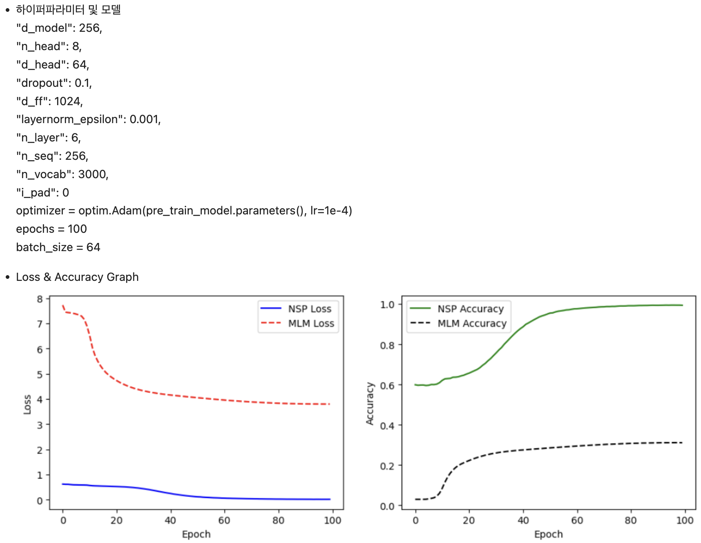
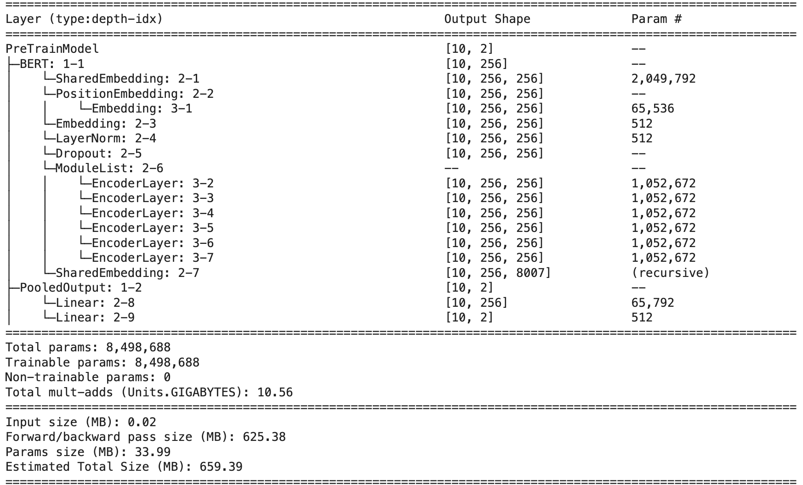
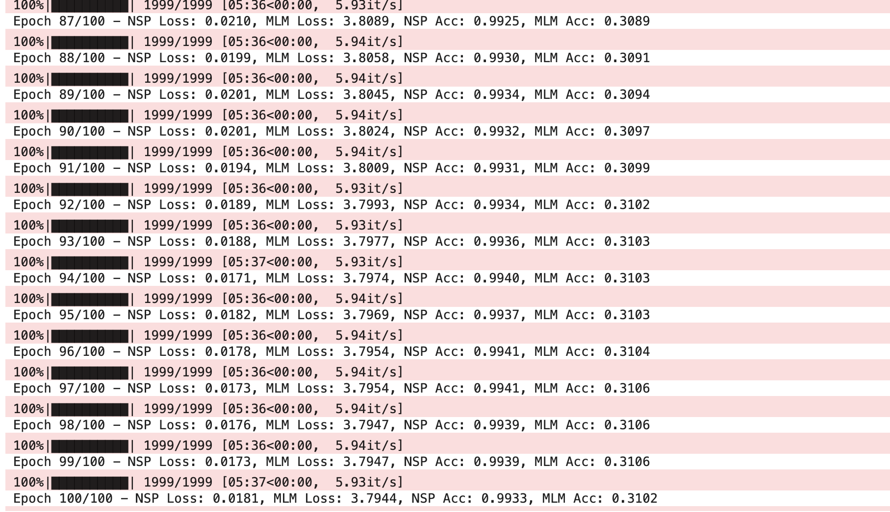
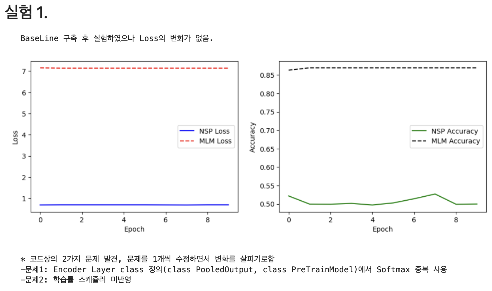
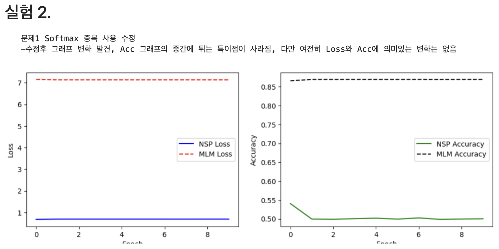
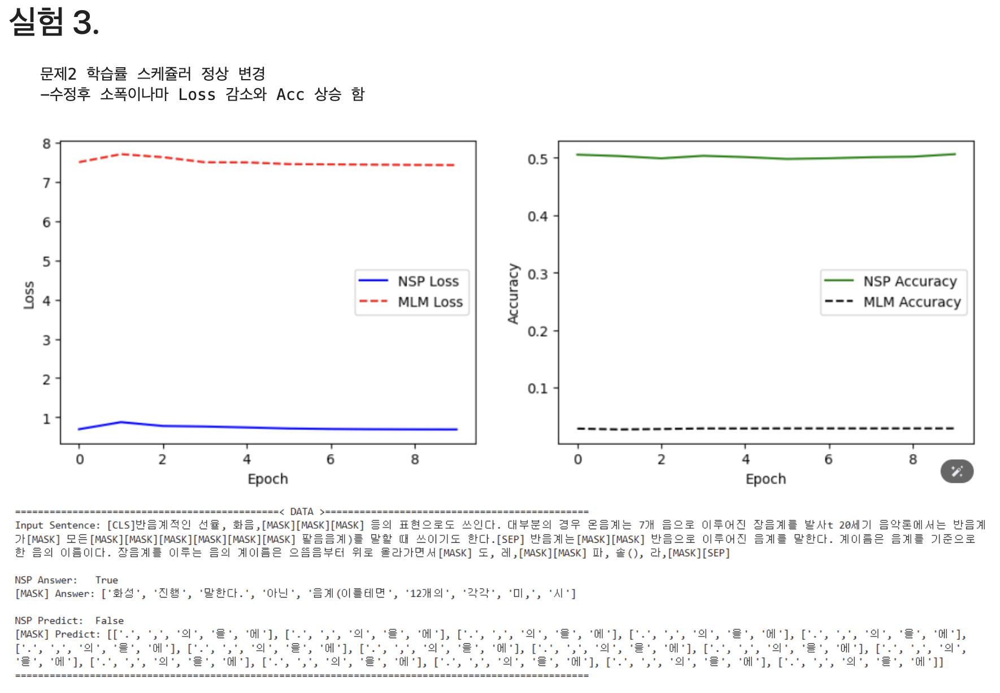
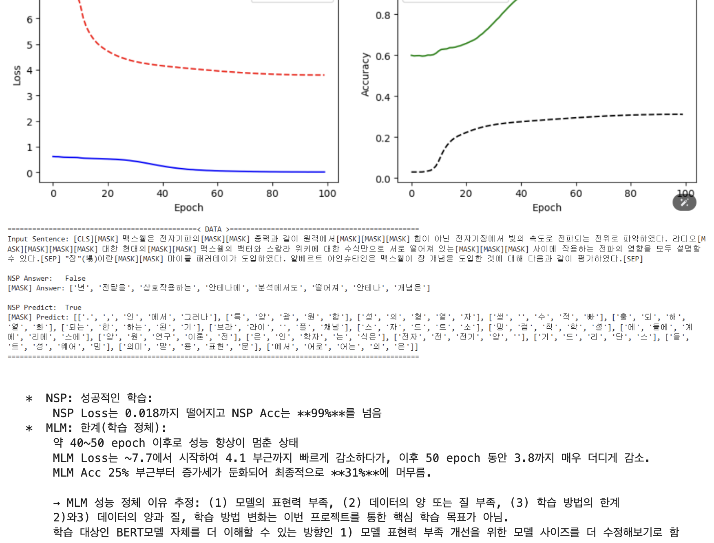
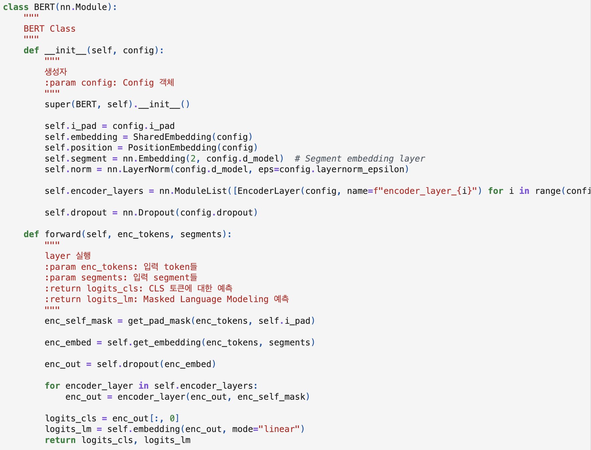
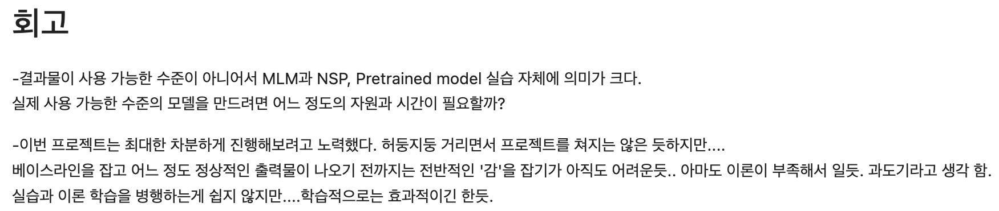

# AIFFEL Campus Online Code Peer Review Templete
- 코더 : 김형일
- 리뷰어 : 이규철


# PRT(Peer Review Template)
- [X]  **1. 주어진 문제를 해결하는 완성된 코드가 제출되었나요?**
    - 문제에서 요구하는 최종 결과물이 첨부되었는지 확인
        - 중요! 해당 조건을 만족하는 부분을 캡쳐해 근거로 첨부





루브릭에서 제시한 mini-bert 구축 보다는 더 큰 모델을 만들어서 실험을 진행하셨습니다. 코드상에 데이터의 절대적인 양을 제한하는 코드가 들어가 있는데
절대적인 데이터의 양을 좀 더 늘려서 실험을 진행하셨으면 결과가 더 좋으셨을거 같습니다. 모델의 하이퍼파라미터를 수정하며 모델의 파라미터 수를 조정하시고
실험을 다양하게 진행하셨습니다.
    
- [X]  **2. 전체 코드에서 가장 핵심적이거나 가장 복잡하고 이해하기 어려운 부분에 작성된 
주석 또는 doc string을 보고 해당 코드가 잘 이해되었나요?**
    - 해당 코드 블럭을 왜 핵심적이라고 생각하는지 확인
    - 해당 코드 블럭에 doc string/annotation이 달려 있는지 확인
    - 해당 코드의 기능, 존재 이유, 작동 원리 등을 기술했는지 확인
    - 주석을 보고 코드 이해가 잘 되었는지 확인
        - 중요! 잘 작성되었다고 생각되는 부분을 캡쳐해 근거로 첨부
        
- [X]  **3. 에러가 난 부분을 디버깅하여 문제를 해결한 기록을 남겼거나
새로운 시도 또는 추가 실험을 수행해봤나요?**
    - 문제 원인 및 해결 과정을 잘 기록하였는지 확인
    - 프로젝트 평가 기준에 더해 추가적으로 수행한 나만의 시도, 
    실험이 기록되어 있는지 확인
        - 중요! 잘 작성되었다고 생각되는 부분을 캡쳐해 근거로 첨부







다양한 실험을 진행하셨습니다. 100에폭을 가져가면서 실험하신게 제 생각에는 모델 크기에 비해 데이터의 수가 작은편에 속하기도 하고 에폭을 100에폭을 가져가셔서
학습데이터에 과적합이 된거같은 느낌이 듭니다.
        
- [X]  **4. 회고를 잘 작성했나요?**
    - 주어진 문제를 해결하는 완성된 코드 내지 프로젝트 결과물에 대해
    배운점과 아쉬운점, 느낀점 등이 기록되어 있는지 확인
    - 전체 코드 실행 플로우를 그래프로 그려서 이해를 돕고 있는지 확인
        - 중요! 잘 작성되었다고 생각되는 부분을 캡쳐해 근거로 첨부



다양한 실험을 통해서 회고를 잘 작성하셨습니다. 루브릭을 다른 방식으로 잘 수행하신거 같습니다.
        
- [X]  **5. 코드가 간결하고 효율적인가요?**
    - 파이썬 스타일 가이드 (PEP8) 를 준수하였는지 확인
    - 코드 중복을 최소화하고 범용적으로 사용할 수 있도록 함수화/모듈화했는지 확인
        - 중요! 잘 작성되었다고 생각되는 부분을 캡쳐해 근거로 첨부

노드의 코드를 활용해서 코드를 잘 작성 하셨습니다.

# 회고(참고 링크 및 코드 개선)
```
# 리뷰어의 회고를 작성합니다.
# 코드 리뷰 시 참고한 링크가 있다면 링크와 간략한 설명을 첨부합니다.
# 코드 리뷰를 통해 개선한 코드가 있다면 코드와 간략한 설명을 첨부합니다.

bert 모델을 구현하고 사전학습을 진행을 잘 하셨습니다. 데이터 구축이 일단 쉽지 않은 과제인거 같습니다. 
제 개인적인 회고는 기회가 된다면 나중에 제가 잘 학습시킨 사전학습 모델을 활용해 다운스트림 테크스를 위해 파인튜닝을 진행해서 활용해보고싶은 생각은 있습니다.
사전학습을 직접 해보는 좋은 경험이었던거 같습니다.

```

